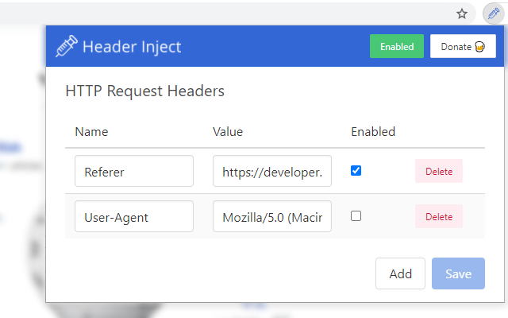

# Header Inject

[](https://github.com/jg23497/Header-Inject/actions/workflows/node.js.yml)

## Background

**An open-source Chrome extension for injecting or overriding HTTP request headers. Simply.**

After installation, access Header Inject's quick options panel by clicking the extension's icon or opening its options tab. The options view allows you to configure custom HTTP headers and to enable HTTP header injection, which is disabled by default when the extension is first installed. 

Header Inject uses Chrome's synchronised storage mechanism, meaning its configuration is automatically synchronised to any Chrome browser you are logged in to.



## Test

Header Inject relies on the [Jasmine](https://jasmine.github.io) unit testing framework. Assuming [Python 3](https://www.python.org) is installed, you can run the unit tests in your favourite browser:

```
python run-tests-in-browser.py
``` 

Or use the [Karma](https://karma-runner.github.io) test runner, assuming [Node.js](https://nodejs.org/en/) is installed:

```
cd tests
npm i
karma start
```

Karma is configured to produce a unit test coverage report. After a test run completes, the report will be available at `tests/coverage`.

## Publish


On Windows:

```
"C:\Program Files (x86)\Google\Chrome\Application\chrome.exe" --pack-extension=<path>\HeaderInject\src
```
